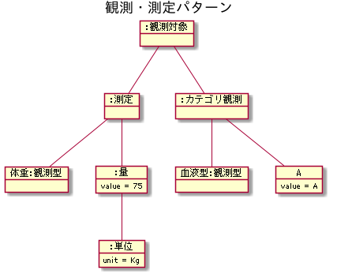

title: グラフデータベースの雑なススメ
layout: true

---
class: center, middle

# グラフデータベースの雑なススメ

## 神山.rb 第二回

永和システムマネジメント 鍜治舍浩

---
# 自己紹介

.left-column[

]

.right-column[
* [永和システムマネジメントの東京支社](http://agile.esm.co.jp/members/developers/kajisha.html)
* 所属: 神山.rb
* GitHub: kajisha
* 座右の銘:
  * 明日できることは今日やらない (土間埋)
]

---
# とあるプロジェクトにて

* あるオブジェクトに属性がいっぱいある
* しかもその属性はさまざまで固定ではない可能性
* 管理者が定義した条件にマッチするオブジェクト群を抽出して
* リコメンデーションのようなことがやりたい

---
# 概念モデル的には観測・測定パターンが近い



---
# 概念モデルを物理モデルに変換するときの課題

* データタイプごとに量のテーブルができてしまう
  * PostgreSQL で型定義しても解決できなかった
* 結合するテーブルが増えるためパフォーマンスに懸念が残る

---
# たとえば範囲のあるデータを扱う必要があった
## よくあるモデルの例

```ruby
create_table :time_shifts do |t|
  t.started_at :timestamp
  t.ended_at :timestamp

  t.timestamps null: false
end
```

---
# でもこれだと取り扱いが辛い

* オーバーラップしないことのチェック
* 終了日時と開始日時の間があかないようにする
* 終端が無限
  * 苦し紛れに終了日時を `9999-12-31 24:59:59` にしたりするでしょ

などなど

---
# そうだ PostgreSQL の範囲型*をつかおう

ちょっと脱線しますよ……

```ruby
create_table :events do |t|
  t.daterange 'duration'
end

Event.create(duration: Date.new(2014, 2, 11)..Date.new(2014, 2, 12))

event = Event.first
event.duration # => Tue, 11 Feb 2014...Thu, 13 Feb 2014

## All Events on a given date
Event.where("duration @> ?::date", Date.new(2014, 2, 12))
```


.footnote[.red.bold[*]
http://edgeguides.rubyonrails.org/active_record_postgresql.html#range-types
]

---
# んーじゃあ Range オブジェクトを渡してもできるかな？

```ruby
Model.where('range_field <@ ?', (1..10)).to_sql
```

ファッ！？うごかない………
なぜなら `Range` オブジェクトは `Arel::Nodes::Between` がかえってきて `BETWEEN
.. AND ...` に変換されるから

こうすればいい

* 1以上10以下
```ruby
Model.where('range_field <@ [1, 10]')
```

* 1以上10未満
```ruby
Model.where('range_field <@ [1, 10)')
```

これなら OK だけど

---
# めんどくさいよね

---
# [宣伝] AR で PG の範囲型をうまく扱えるようにしよう

## doremi (inspired by postgres_ext)

https://github.com/kajisha/doremi

(READMEまだちゃんと書いてません・・・)

---
# つかいかた

## 指定した範囲を含む
```ruby
Model.where.contains(range_field: (1..10))
```

## 指定した範囲を一部含む
```ruby
Model.where.overlap(range_field: (1..10))
```

などなど

(詳細は spec を見てください・・・)

---
class: center, middle

# 閑話休題

---
# まとめ: RDB(pg) だと何がつらいのか

* オブジェクト間の複雑なリレーションが表現できない（リレーショナルなのにね）
  * どこまで再帰するかわからない関連なんて SQL で書くのムズイ
  * やりたいことは集合論だけで扱えないのだよ
* カラムの型の制約が強すぎる
  * スーパタイプでカラムを定義したらサブタイプで格納できてもいいのにね・・・
* 概念モデルと物理モデルのギャップ

---
class: center, middle

# そこでグラフデータベース(neo4j)

---
# Neo4j の特徴

* グラフ理論ベースのデータベースエンジン
  * オブジェクトとオブジェクトに関係があるものは何でも表現できる
* スキーマレス
* トランザクション制御もちゃんとある

## こんなところで使われてる*(らしい)

Master Data Management, Network and IT Operations, Real-Time Recommendations, Fraud Detection, Social Network, Identity and Access Management, Graph-Based Search, などなど

.footnote[.red.bold[*] http://neo4j.com/use-cases/ ]

---
# かんたんリコメンデーションのデモ

よくある○○を見たユーザは、○○も見ています！ みたいなやつ

ユーザ数: 500人
アニメ: 2300タイトル
一人あたりスキと答えてるタイトル数: 10*rand タイトル

関連: ユーザが`スキ`と答えたアニメ

---
# まとめ

* (なんでもグラフデータベースにすればいいというわけじゃないけど)便利
* グラフになるデータ構造を扱うときはぜひご利用をご検討ください

---
# QA

---
class: middle, center
# ありがとうございました

今日のスライドは以下で公開しています。

* https://kajisha.github.io/kamiyama.rb-2nd
